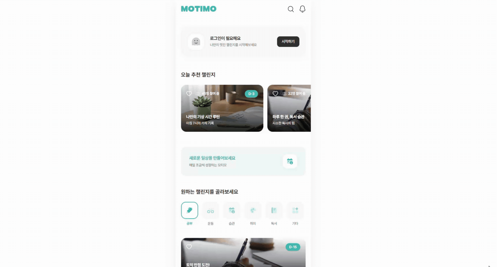

# Motimo

> 일상 속 목표를 챌린지로 만들고 꾸준한 습관을 형성하는 모바일 웹 서비스



[🔗 홈페이지 바로가기](https://motimo-pi.vercel.app/)

## 🚀 프로젝트 소개

일상적인 목표 달성과 지속적인 동기 부여를 돕기 위해 기획된 서비스입니다.
시각적인 출석 현황과 통계를 제공해 사용자가 꾸준히 습관을 만들어갈 수 있도록 설계했습니다.

## ⚙️ 주요 기능

- **인증**
  - 목업 기반 로그인 처리 및 전역 상태 관리
  - 상태 기반 UI 구조를 통해 게스트와 회원의 진입 흐름을 자연스럽게 분기

- **챌린지**
  - 참여/탈퇴 상태 토글 및 1일 1회 출석 체크
  - 모바일 중심 UX 설계를 적용하여 일상에서의 빠르고 직관적인 상호작용 제공

- **찜하기**
  - 관심 챌린지 하트 토글 및 별도 저장
  - 개인화된 관심사 저장을 통해 사용자의 지속적인 동기 부여 유지

- **마이페이지**
  - 프로필 요약 통계 및 상태별 챌린지 조회
  - 토큰 기반 디자인 시스템을 활용해 복잡한 통계 데이터의 시각적 일관성 극대화

- **검색**
  - 실시간 키워드 필터링 및 최근 검색어 내역 관리
  - 실시간 피드백과 캐싱을 통해 빠르고 끊김 없는 정보 탐색 경험 제공

- **알림**
  - 상대 시간(방금 전, 1일 전 등) 표시 및 자동 읽음 처리
  - 즉각적인 인터랙션 피드백을 전달하여 사용성 향상

## 🎨 UI/UX 특징

- **모바일 중심 설계**: 일상에서 빠르게 접근하는 환경을 고려해 모바일 사용성 최우선 반영
- **상태 기반 UI 분기**: 게스트와 회원 접속 상태를 판별해 환영 메세지와 빈 화면 동적 노출
- **카드 중심 구조**: 배지, 참가자 수 등 복잡한 정보를 직관적으로 담아낸 모듈형 카드
- **가로 스크롤 UX**: 좁은 화면을 효율적으로 쓰기 위해 횡스크롤을 적용한 레이아웃

## 🛠 기술 스택

**Frontend**

 

> 컴포넌트 기반 UI 설계와 빠른 개발 환경 구축

**State Management**


> 간결하고 직관적인 전역 상태 관리

**Styling**


> 유틸리티 클래스를 활용한 빠른 스타일링과 동적 구조 제어

**Routing**


> SPA 환경의 클라이언트 라우팅 처리

**Library**


> 모바일 환경에 최적화된 캐러셀 및 터치 스와이프 구현

## 🧠 상태 관리 구조

`Zustand` persist 미들웨어 적용으로 브라우저 새로고침 시에도 상태를 유지합니다.

- `useAuthStore`: 유저 로그인 상태 및 회원 정보 관리
- `useChallengeStore`: 참여 및 찜한 챌린지 목록, 누적 출석 데이터 관리
- `useSearchStore`: 최근 검색어 히스토리 저장 및 단건/전체 초기화
- `useNotificationStore`: 수신 알림 내역 보관 및 읽음 상태 토글

## 📁 폴더 구조

```text
src/
 ├─ components/  # 재사용 Layout(헤더, 탭바) 및 범용 UI 요소
 │   ├─ layout/
 │   └─ ui/
 ├─ features/    # 도메인 및 화면별 비즈니스 컴포넌트
 │   ├─ auth/
 │   ├─ detail/
 │   ├─ home/
 │   └─ mypage/
 ├─ pages/       # 라우팅 주소와 매칭되는 최상위 컨테이너
 │   ├─ ChallengeDetail/
 │   ├─ ComingSoon/
 │   ├─ HomePage/
 │   ├─ Login/
 │   ├─ MyPage/
 │   ├─ Notification/
 │   └─ Search/
 ├─ store/       # Zustand 전역 상태 관리 로직
 ├─ data/        # 초기 화면 구성을 위한 목업 데이터 및 정적 상수
 └─ assets/      # 정적 리소스 (폰트, SVG 아이콘, 이미지)
     ├─ fonts/
     ├─ icons/
     └─ images/
```
